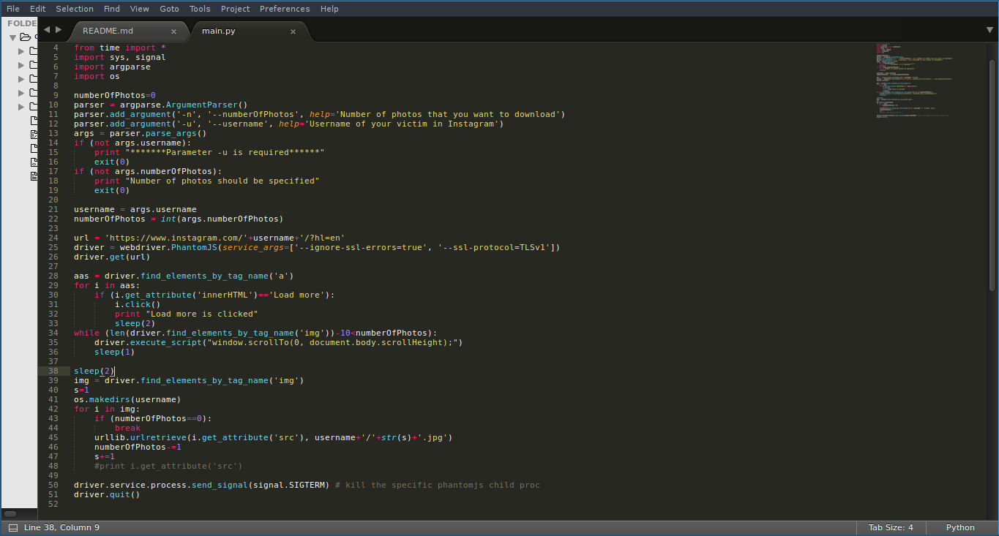
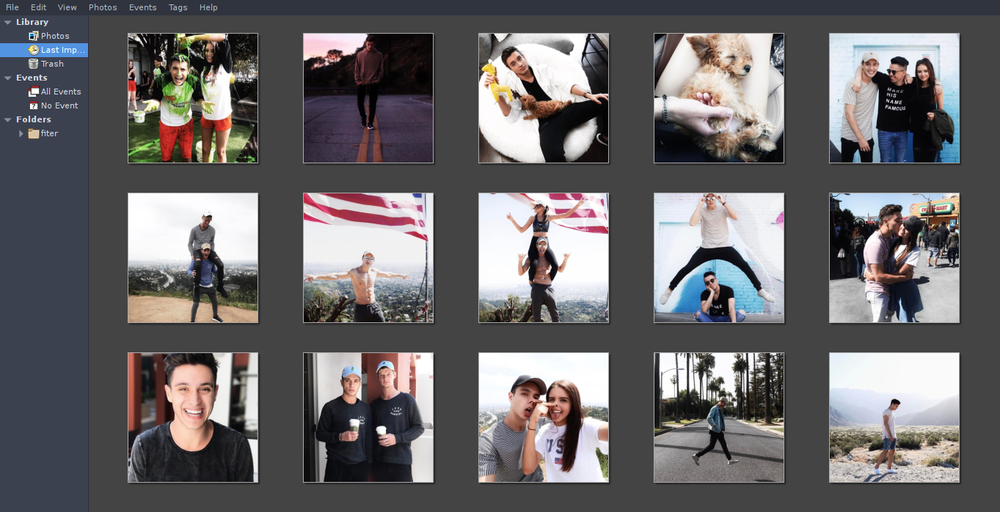

# InstagramPictures


## Overview
Script to download a pictures of certain user and save it to the folder(named by username)

## How to use 
```
python main.py -u <USERNAME> -n <PHOTO COUNT>
```


## Screenshots


