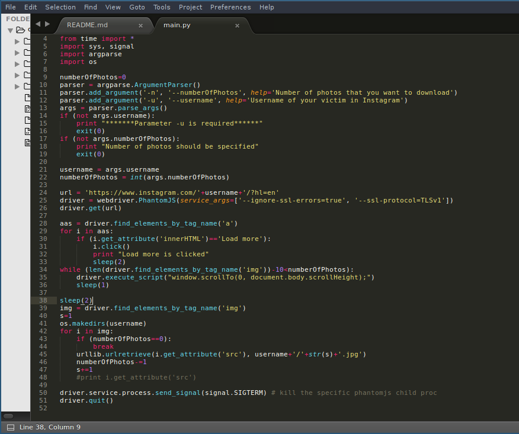

# InstagramPictures
[](https://badge.fury.io/py/instagramPictures)
[](https://pypi.python.org/pypi/instagramPictures/)


## Overview
Script to download a pictures of certain user and save it to the folder(named by username)


## Installation
```
pip install instagramPictures
```

## Usage example 
```bash
# takes 50 last photos of gabrielconte
instagramPictures -u gabrielconte -n 50

# seek for help ?
instagramPictures --help
```


## Screenshots


